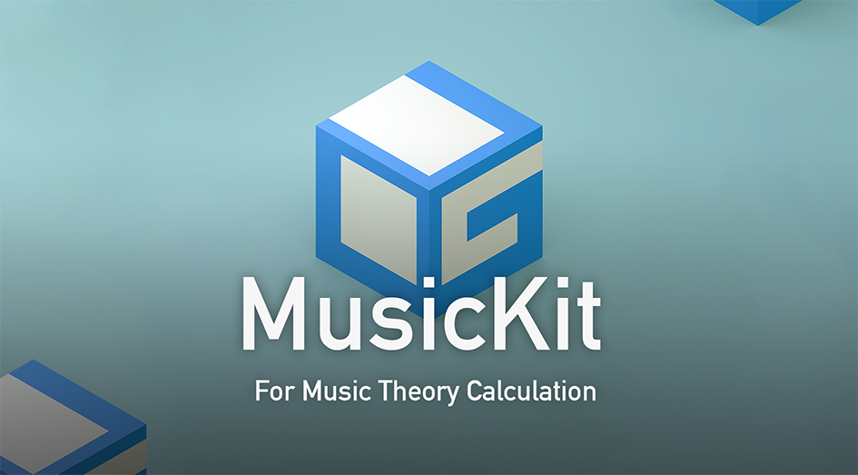

# 乐理计算器网页版

GitHub Pages:

https://guohub8080.github.io/musickit_v1/#/readme

乐理计算器是一个辅助计算乐理的小程序， 目前支持音程的上下行及正反向查询、七个中古调式的调内和弦及反向和弦查询。

# 程序定位
该程序定位于音乐理论辅助，帮助实现基本乐理的计算，同时可用于辅助音乐分析。该程序的目标并非分析音频或MIDI文件。

# 使用注意
默认用户在电脑端使用，未适配移动端；

使用了较多新CSS语法，例如flex与grid定位，IE浏览器或较旧版浏览器可能显示不正确；

重升/重降音简单标注为两个升号/降号，严格来说并不正确。

# 引用技术栈
Web框架：Vue3

UI组件库（部分使用）：Ant Design Vue 

计算结果过滤：TaffyDB (taffy.js) （老项目使用，现已不推荐使用，推荐更换为collect.js）

# 使用说明

在导航条的下方有一个选择条，该选择条称为「基准音选择器」。基准音选择器分为左右两部分，左部分称为「step」，右部分称为「alter」。

step在CDEDFGAB七个音中选择一个作为基准音，alter分别为natural（自然/还原）音，sharp（升半音）音和flat（降半音）音。

基准音选择器是该程序计算的起点，默认值为C。

# 音程计算
点击导航条的「interval」选项，进入音程计算模块。

钢琴窗的蓝色按钮表示按下的位置为基准音选择器的音，可以通过基准音选择器改变钢琴按键，也可以通过键盘快捷键：

▶ 只改变基准音选择器的step，不改变alter：CDEFGAB

▶ 只改变step相对值，不改变alter值：,表示左移1，.表示右移1。

▶ 不改变step值，只改变alter绝对值：对应关系为0表示natural，-表示flat，=表示sharp。

▶ 不改变step值，只改变alter相对值：\[表示alter值左移1，如果是flat则无变化；]表示alter值右移1，如果是sharp则无变化。

▶ 钢琴键盘选择位移：←和→

位移规则：无论黑白键，左键表示位移左移1，右键表示位移右移1，白键一律为还原音，黑键则看位移方向。 若向左移到黑键，则为降音；若右移到黑键，则为升音。例：移动前为D音，右移1为D♯/E♭，因向右为升，则显示为D♯。

▶ 切换黑键名称：V

仅选择在黑键生效，若当前为升音，则转为降音，反之亦然。例如C♯音按下后转为D♭音。

▶ 随机在step与alter中选择：R

在钢琴窗中还可以任意点击按键，点击后选中的按键标为橙黄色。橙黄色标记的音与基准音选择器无关，只与钢琴窗右侧的音程表有关。

当钢琴窗同时有蓝色与橙黄色的选择键时，按下X可以切换二者位置，将橙黄色的音替换为基准音选择器的音。

音程表内容解释:

NAME 基准音选择器的音名。

LOC 键盘的半音数，C为1，以此类推。

GAP 在键盘上选择的音和基准音选择器的半音差值。

TARGET 在键盘上选择的音的音名。

FIFTH 基准音选择器在五度圈的位置，也即谱面升降号的数量。

LOC 在键盘上选择的音的半音数。

INTERVAL 在键盘上选择的音和基准音选择器的音程。

中间部分为音程穷举表。当鼠标移入特定单元格时，若高亮显示，则表示可以进行点击，点击后，将当前单元格的音替换为基准音选择器的音。

上行音程表示基准音升高某个音程后是何音。小括号内的数字表示半音差。

下行音程表示何音升高某个音程后是基准音。小括号内的数字同样表示半音差。

# 音阶计算

该部分支持自然大小调、Dorian、Phrygian、Lydian、Mixo-lydian和Locrian调式的音阶及调内和弦查找功能。

该部分的基准音选择器多了一项「设置」功能，可从设置中调整计算的音阶名称，即基准调式音阶。

当鼠标移过调内和弦时，会悬窗展示该和弦的和弦类型及具体组成音。

可通过设置调整以罗马数字（Ⅰ-Ⅳ-Ⅴ）展示或以阿拉伯数字（1-4-5）展示。

反向调式指何调式包含基准音选择器的音，并具体到第几个音。例如，包含 C 的调式有「F自然大调V」，即F自然大调的第五级音为C。经验证，F自然大调的构成音为F、G、A、B♭、C、D和E，计算正确。

移动鼠标至反向调式中的单元格，若可以高亮展示，则表示可以触发点击事件。点击后，将所在单元格的主音及调式自动替换为基准音选择器的主音和基准调式。

若基准音阶底色为深色，则表示该音阶并不实际存在。例如C♭大调的组成音若按照正常计算则为：C♭、D♭、E♭、F♭、G♭、A♭、B♭，全部音均有降号，这在乐理上是不被允许的，需要替换为等音，即B、C♯、D♯、E、F♯、G♯和A♯。

# 关于作者
联系邮箱：guo2018 # 88.com（请将#替换为@）

如有任何问题、提出新功能、报送Bug，请邮箱联系。
